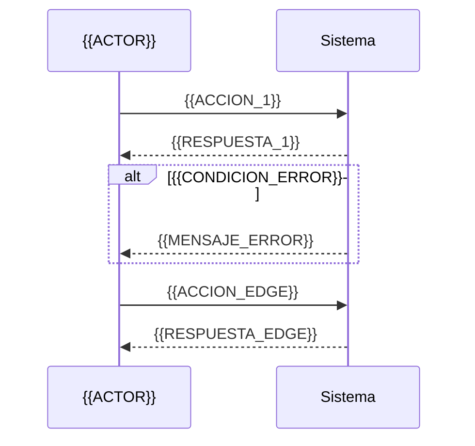

# Flow {{NUM}} — {{Nombre del flujo}}

## Resumen

<!--
2-3 líneas. Qué capability cubre, actor principal, condición de éxito.
Ejemplo (e-learning): "Búsqueda y selección de curso por estudiante.
Inicia en home, termina con el estudiante en la página de detalle del curso
con el botón de inscripción visible."
-->

## Diagrama



<!--
Variante con flowchart cuando domina la ramificación:

```mermaid
flowchart TD
  Inicio[{{Pantalla inicial}}] --> Decision{{{Condición}}}
  %% T-{{NUM_TAREA_1}}
  Decision -- sí --> Caso1[{{Resultado happy}}]
  %% T-{{NUM_TAREA_1}}
  Decision -- no --> Caso2[{{Resultado error}}]
  %% T-{{NUM_TAREA_2}}
  Caso1 --> Raro[{{CASO_RARO}}]
```
-->

## Trazabilidad

| Paso | Tarea | Criterio |
|---|---|---|
| 1 | T-{{NUM_TAREA_1}} | AC-1 (happy) |
| 2 | T-{{NUM_TAREA_1}} | AC-2 (error) |
| 3 | T-{{NUM_TAREA_2}} | AC-3 (edge) |

## Notas

<!--
Opcional. Decisiones de diseño, dependencias con otros flows, riesgos UX.
Si una tarea de la bloque no fue cubierta intencionalmente, justificar aquí
para que el `flows-auditor` no la reporte como huérfana.
-->
